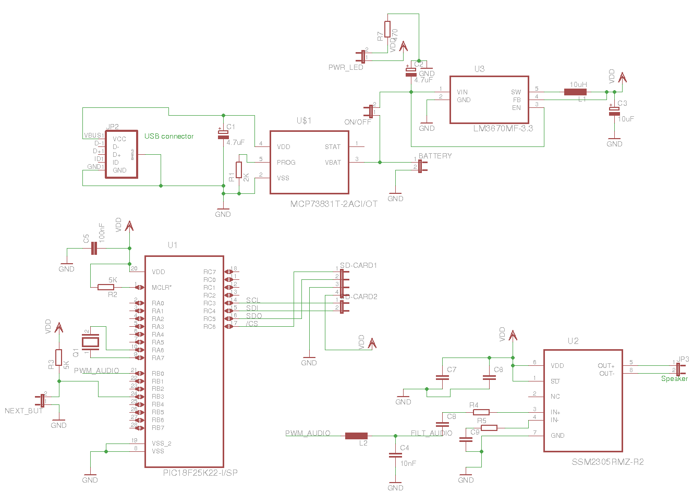

# dariabox

Audio player with 8-bit MCU and SD-card storage

# Hardware

This project is a battery powered audio player that plays raw audio files from a SD card.

The battery is rechargable through USB.

The project uses a 8 bit PIC18F25K22 microcontroller to interface the SD card over SPI and output audio data from the PWM channel.

Audio comming out of the PWM channel is low-pass filtered and sent to an amplifier that drives the speaker.

I got inspiration from this project: http://dmitry.gr/?r=05.Projects&proj=18.%20Holiday%20Card

# Schematic

# Software

The SD card is formatted as FAT and stores the raw audio data in different files.

Audio data format is 44,1KHz with 8 bits resolution. I used Audacity tool to export audio data in raw files and then copied them to the SD card.

In order to access the files from the SD card, I use the `Petit FAT` library written by ELM-Chan: http://elm-chan.org/fsw/ff/00index_p.html.

In order to use the library you need to add int `petitfat/sd-mmc.c` source:

* your hw specific SPI transmit function: `xmit_spi`
* your hw specific SPI receive function: `rcv_spi`
* your hw specific microseconds delay: `dly_us`
* your hw specific macros for the card select/deselect: `SELECT`, `DESELECT`, `MMC_SEL`

I had to also do a small modification to the library, to remove a recursive function call during card initialization, since Microchip's XC8 compiler doesn't allow recursion.

This library is written for systems with low flash and RAM resources. Since I use 1KB out of 1,5KB of RAM to store audio buffers, there's not too much RAM left for other operations. This library fitted me perfectly. It doesn't feature all FAT functionality but it does feature more than I need.

The song list is shuffled at every boot. For shuffling I'm using the Fisher-Yates algorithm https://en.wikipedia.org/wiki/Fisher%E2%80%93Yates_shuffle.

Shuffling needs random numbers. So at each board boot I use `srand()` function to seed the random number generator with the least significant 3 bits of an ADC read. The ADC pin is left unconnected to pick up noise. This gives us 8 possible shuffling combinations. Not that much but good enough.

A button is used to skip to the next song if needed.

# Youtube demo

https://www.youtube.com/watch?v=l7jjTI74dWg